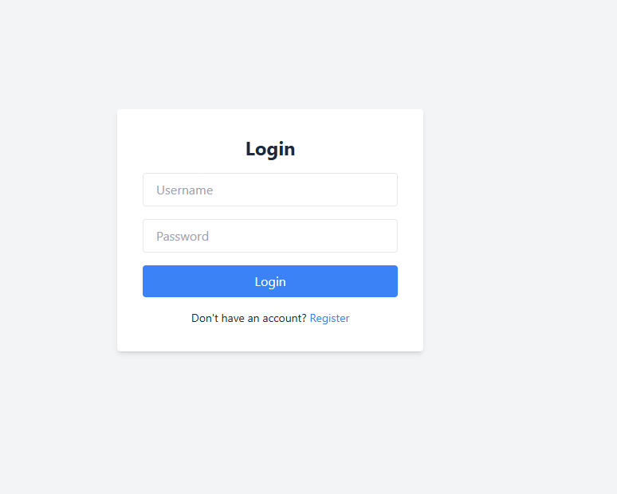
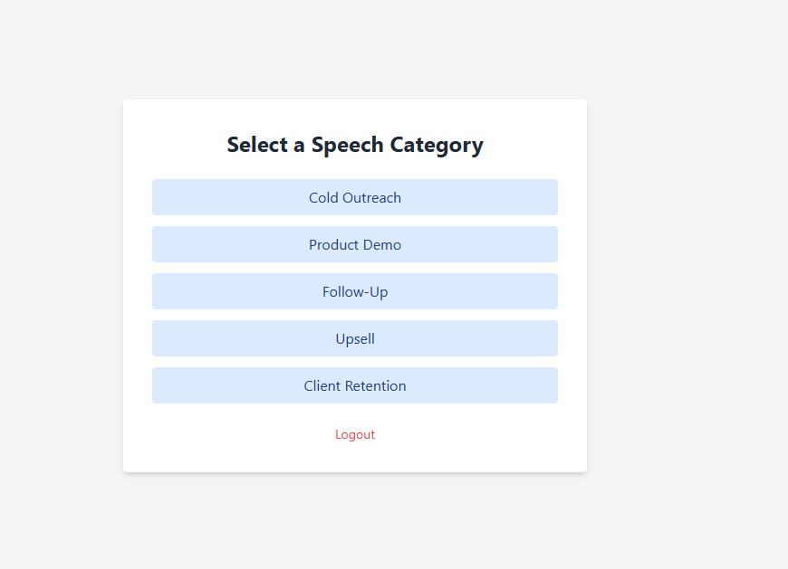
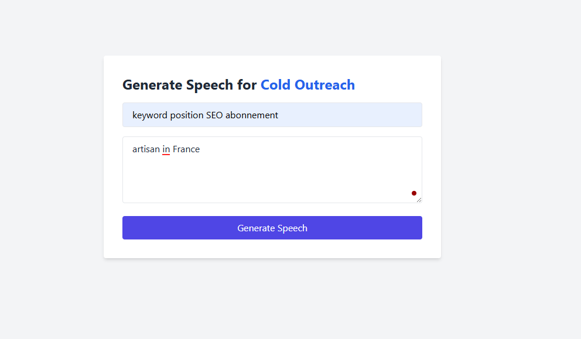
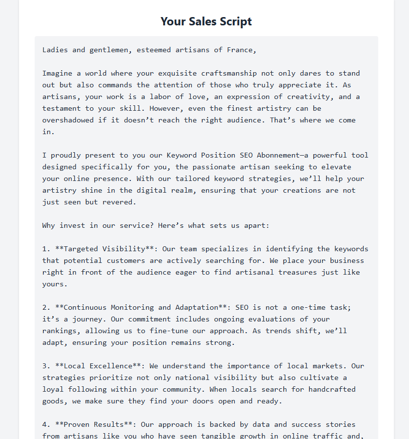

# 🗣️ Sales Speech Generator – AI for Real-Time Sales Enablement

A Django-based AI platform that generates **tailored, persuasive sales scripts in real time**, helping lead acquisition and sales teams personalize outreach with on-brand messaging powered by LLMs.


---

## 🚀 Features

- **User Authentication**: Sign up, log in, and log out.
- **Speech Category Selection**: Choose from categories such as Cold Outreach, Product Demos, Follow-Ups, Upsell, etc.
- **AI-Powered Sales Scripts**: Generate persuasive sales scripts based on user inputs, including product details and client profiles.
- **Clean UI**: Built with **Django** and styled with **TailwindCSS** for modern and responsive design.
- **Real-Time Script Generation**: Instantly create sales scripts using AI prompts powered by **OpenAI's GPT models**.

---

## Tech Stack

- **Backend**: Django (Python)
- **Frontend**: HTML, TailwindCSS
- **AI**: OpenAI API (GPT-4)
- **Environment Management**: python-dotenv

---

## 📸 Screenshots

### Login Page


### Category Selection


### Select the product


### Generated Sales Script


---

## Setup Instructions

### 1. Clone the repository
``` bash
git clone https://github.com/yourusername/sales-speech-generator.git
cd sales-speech-generator 
```

### 2. Create Virtual Environment
``` bash
python -m venv venv
source venv/bin/activate 
```

### 3. Install Dependencies
``` bash 
pip install -r requirements.txt
```

### 4. Configure Environment
Create a .env file in the project root:
``` bash 
OPENAI_API_KEY=your-openai-api-key-here
```

### 5. Apply Migrations and Run
``` bash
python manage.py makemigrations
python manage.py migrate
python manage.py runserver
```
Visit http://127.0.0.1:8000/ in your browser.

---

## 📁 Project Structure
``` bash
project/
├── sales_speech_generator/   # Django project folder
│   ├── __init__.py
│   ├── asgi.py
│   ├── settings.py
│   ├── urls.py
│   └── wsgi.py
├── core/                     # Main Django app
│   ├── __init__.py
│   ├── admin.py
│   ├── apps.py
│   ├── models.py
│   ├── views.py
│   ├── urls.py
│   ├── utils.py
│   ├── templates/
│   │   └── core/
│   │       ├── base.html
│   │       ├── login.html
│   │       ├── register.html
│   │       ├── select_category.html
│   │       ├── prompt_input.html
│   │       └── generated_script.html
├── .env                      # API Key
├── requirements.txt
└── README.md

```

---

## 📄 License
This project is licensed under the MIT License.